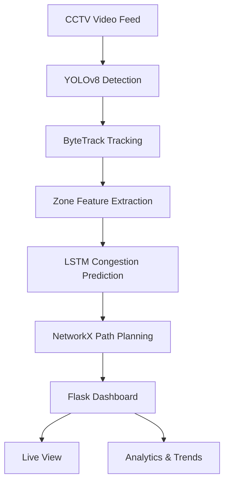

# 🚨 AI-Based Evacuation Optimization System


An intelligent, real-time evacuation optimization system designed for crowded public venues such as malls, railway stations, and stadiums. The system leverages state-of-the-art computer vision and machine learning (LSTM) to monitor crowd density, predict exit congestion precisely, and dynamically recommend the safest evacuation routes.

---

## 🌟 Key Features

* **Real-Time Person Tracking:** Utilizes highly optimized YOLOv8 pedestrian detection and ByteTrack multi-object tracking to identify and follow individuals across video frames.
* **LSTM Congestion Prediction:** Uses a PyTorch-trained Long Short-Term Memory (LSTM) Neural Network to analyze crowd density, average speed, and headcount to predict gridlocks and bottlenecks *before* they occur.
* **Dynamic Path Planning:** Computes the safest, most efficient multi-hop evacuation route avoiding congested corridors using a NetworkX Dijkstra algorithm.
* **Interactive Live Dashboard:** A beautiful dark-themed web interface built directly into Flask that streams the annotated live camera feed side-by-side with an interactive floor map.
* **Rich Analytics:** Records long-term historical CSV data allowing venue operators to review footfall trends, average movement speeds, and exit choke-points using interactive charts.

---

## 🏗 System Architecture

The pipeline is entirely multi-threaded, meaning the heavy Machine Learning inference runs smoothly in the background while the UI remains perfectly responsive.



---

## ⚙️ Local Setup (Windows)

The application has been explicitly tailored to run natively on standard Windows hardware without requiring a bulky GPU. 

### 1. Clone the Repository
```cmd
cd your-projects-folder
git clone <repository_url>
cd evacuation-system
```

### 2. Prepare Virtual Environment
We highly recommend isolating your dependencies using a Python `venv`.
```cmd
python -m venv venv
venv\Scripts\activate
```

### 3. Install PyTorch (CPU-Only)
Running advanced neural networks on a CPU requires the specific local wheels.
```cmd
pip install torch torchvision torchaudio --index-url https://download.pytorch.org/whl/cpu
```

### 4. Install Dependencies
```cmd
pip install -r requirements.txt
```

---

## 🚀 Running the Application

Once your environment is set up and activated, you can launch the live AI pipeline directly from your terminal:

```cmd
python app.py
```

* **Live Dashboard:** Open `http://127.0.0.1:5000` in your web browser.
* **Analytics Tab:** Available at `http://127.0.0.1:5000/analytics` to view live charts.
* **Fullscreen:** You can click on any video feed or floor map in the dashboard to expand it to edge-to-edge fullscreen!

---

## 🛠 Customizing the System

The entire solution is built to be dynamically reconfigurable for any building layout!

### Modifying Exit Zones
You do not need to edit code to change your exit limits! You can adjust the capacities of any zone from the **⚙️ Settings** menu directly on the Live Dashboard. 
* To redefine where the actual boundary boxes are drawn on the camera frame, you can update `data/zones.json`.

### Changing the Floor Map
You can upload a custom PNG or JPG of your exact building schematic directly through the Dashboard's **⚙️ Settings** menu. The pathfinding graph (`data/venue_graph.json`) can be modified to map perfectly onto your specific floor plan.

---

## ☁️ Cloud Training Data (Colab)

If you wish to retrain the Neural Networks on your own datasets to improve speed/density recognition:
1. Upload the `notebooks/` folder to your Google Drive.
2. Open `colab_setup.ipynb` in Google Colab with a GPU runtime to mount your drive.
3. Follow the steps in `01_yolov8_finetune.ipynb` for detection, and `02_lstm_training.ipynb` for the Congestion sequence predictor.

---

## 📦 Tech Stack

| Component | Library |
|---|---|
| **Person Detection** | YOLOv8 (Ultralytics) |
| **Multi-Person Tracking** | ByteTrack via `supervision` |
| **Congestion AI** | Long Short-Term Memory Network (PyTorch) |
| **Path Routing** | `NetworkX` (Dijkstra Algorithm) |
| **Web Server** | Flask & Jinja2 |
| **Data Streaming** | OpenCV MJPEG streams |
| **Analytics** | Pandas & Chart.js |
