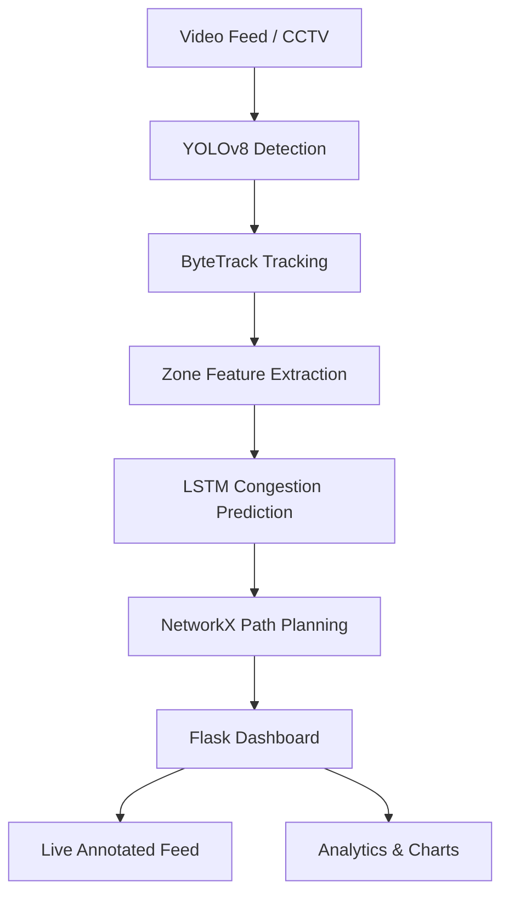

# AI-Based Evacuation Optimization System


A real-time crowd monitoring and evacuation routing system for public venues (malls, stations, stadiums). It uses YOLOv8 for person detection, ByteTrack for multi-object tracking, an LSTM neural network for congestion prediction and Dijkstra path planning to recommend the safest exit routes — all streamed to a live web dashboard.

---

## Features

- **Real-time person detection & tracking** — YOLOv8 + ByteTrack identifies and follows individuals across video frames
- **LSTM congestion prediction** — PyTorch LSTM predicts exit bottlenecks before they occur, using crowd density, speed, and headcount as input features
- **Dynamic path planning** — NetworkX Dijkstra finds the least-congested multi-hop evacuation route in real time
- **Live web dashboard** — dark-themed Flask interface streams the annotated camera feed alongside an interactive floor map
- **Analytics** — historical CSV logging with interactive Chart.js charts for footfall trends, speed, and choke-point analysis
- **Fully CPU-based** — runs on standard Windows hardware without a GPU

---

## System Architecture



The ML pipeline runs in a background thread so the web UI stays responsive at all times.

---

## Prerequisites

- Python 3.13
- Windows (setup instructions below are Windows-specific; Linux/macOS may need minor path adjustments)
- The following binary assets placed manually before running:
  - `data/videos/sample_crowd.mp4` — your crowd video source
  - `models/lstm_congestion.pt`, `models/lstm_scaler.pkl`, `models/lstm_config.json` — trained LSTM weights *(if absent, the system falls back to rule-based congestion status)*
  - `models/yolov8_person.pt` — fine-tuned YOLOv8 weights *(if absent, ultralytics auto-downloads `yolov8n.pt` on first run)*

---

## Setup

### 1. Clone the repository

```cmd
git clone <repository_url>
cd evacuation-system
```

### 2. Create a virtual environment

```cmd
python -m venv venv
venv\Scripts\activate
```

### 3. Install PyTorch (CPU-only)

PyTorch must be installed **before** the rest of the dependencies — it is not in `requirements.txt` and requires a special index URL:

```cmd
pip install torch torchvision torchaudio --index-url https://download.pytorch.org/whl/cpu
```

### 4. Install remaining dependencies

```cmd
pip install -r requirements.txt
```

---

## Running the Application

```cmd
python app.py
```

| URL | Description |
|---|---|
| `http://localhost:5000` | Live annotated feed + floor map |
| `http://localhost:5000/analytics` | Historical charts and trends |

> **Note:** Flask debug mode must remain **off** (`FLASK_DEBUG = False` in `config.py`). Debug mode spawns a second process that starts a second pipeline thread.

### Using a webcam or live feed instead of a video file

Set the `VIDEO_SOURCE` environment variable before running:

```cmd
set VIDEO_SOURCE=0          # default webcam
set VIDEO_SOURCE=rtsp://... # RTSP stream
python app.py
```

---

## Customizing for Your Venue

All venue-specific configuration is in `data/` and `static/` — no code changes required.

### Redefine exit zones

```cmd
python Tools/define_zones.py
```

Opens an interactive OpenCV window. Draw bounding boxes over your exit areas and save to `data/zones.json`. Zone capacity thresholds can also be adjusted live from the dashboard's Settings menu.

### Rebuild the evacuation graph

```cmd
python Tools/define_graph.py
```

Opens an interactive GUI to place nodes and edges on your floor plan, saved to `data/venue_graph.json`.

### Replace the floor map

Upload a PNG/JPG of your building schematic via the Dashboard's Settings menu, or replace `static/images/floormap.png` directly.

---

## Testing & Diagnostics

```cmd
# End-to-end pipeline test
python test_pipeline.py [--no-display] [--no-log] [--video PATH] [--max-frames N]

# LSTM model validation
python tests/phase6_test.py

# LSTM inference diagnostics (writes results to diag_out.txt)
python diag_lstm.py
```

---

## Training Your Own Models

Training notebooks live in `notebooks/` and are designed to run on Google Colab (GPU runtime recommended):

1. Upload the `notebooks/` folder to Google Drive
2. Open `colab_setup.ipynb` in Colab and mount your drive
3. Run `01_yolov8_finetune.ipynb` to fine-tune the person detector on your dataset
4. Run `02_lstm_training.ipynb` to train the congestion sequence predictor

Export the resulting weights to `models/` before running `app.py`.

---

## Project Structure

```
evacuation-system/
├── app.py                  # Flask entry point
├── config.py               # All tunable parameters and file paths
├── requirements.txt
├── src/
│   ├── pipeline.py         # Threaded background processor
│   ├── detection.py        # YOLOv8 wrapper
│   ├── tracking.py         # ByteTrack wrapper
│   ├── zones.py            # Exit zone manager
│   ├── features.py         # Crowd feature extractor
│   ├── congestion.py       # LSTM inference engine
│   └── pathplanning.py     # NetworkX graph + Dijkstra
├── utils/
│   ├── logger.py           # Console + file logging
│   └── visualizer.py       # OpenCV annotation helpers
├── Tools/
│   ├── define_zones.py     # Interactive zone drawing GUI
│   ├── define_graph.py     # Interactive graph builder GUI
│   └── generate_synthetic_data.py
├── templates/              # Jinja2 HTML templates
├── static/                 # CSS, JS, floor map image
├── data/
│   ├── zones.json          # Exit zone definitions
│   ├── venue_graph.json    # Pathfinding graph
│   ├── videos/             # Video sources (not committed)
│   └── logs/               # Auto-generated CSV logs
├── models/                 # Model weights (not committed)
├── notebooks/              # Colab training notebooks
└── tests/
    └── phase6_test.py
```

---

## Tech Stack

| Component | Library |
|---|---|
| Person detection | YOLOv8 (Ultralytics 8.3) |
| Multi-person tracking | ByteTrack via `supervision 0.24` |
| Congestion prediction | LSTM (PyTorch, CPU-only) |
| Path routing | NetworkX 3.4 — Dijkstra |
| Web server | Flask 3.1 + Jinja2 |
| Video streaming | OpenCV 4.10 MJPEG |
| Analytics | Pandas 2.2 + Chart.js |
| Feature scaling | scikit-learn 1.6 |
